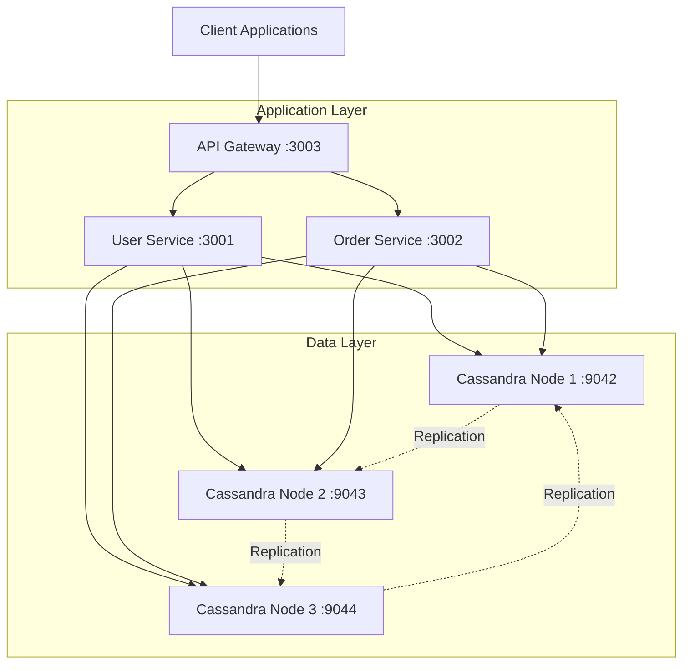

# 🛒 Hệ Thống Quản Lý Người Dùng & Đơn Hàng Phân Tán

[](./tests)
[](./docker-compose.distributed.yml)
[](https://nodejs.org/)
[](https://cassandra.apache.org/)

## 📋 Tổng Quan

Hệ thống **quản lý người dùng và đơn hàng** được xây dựng với kiến trúc **microservices phân tán**, sử dụng **Apache Cassandra** làm cơ sở dữ liệu. Dự án được thiết kế với khả năng mở rộng cao, fault tolerance và bao gồm framework testing toàn diện để đảm bảo tính ổn định trong môi trường production.

### 🎯 Mục Tiêu Dự Án

Xây dựng một **hệ thống thương mại điện tử cơ bản** với các tính năng:
- **👤 Quản lý người dùng**: Tạo, xem, cập nhật thông tin người dùng
- **🛒 Quản lý đơn hàng**: Tạo đơn hàng, theo dõi trạng thái, lịch sử mua hàng
- **🏗️ Kiến trúc microservices**: API Gateway, User Service, Order Service
- **🗄️ Database phân tán**: 3-node Cassandra cluster với replication factor = 3
- **🧪 Testing framework**: 6 test suites toàn diện đảm bảo chất lượng
- **📊 Monitoring & Logging**: Giám sát real-time và logging tập trung
- **🚀 Deployment tự động**: Docker Compose và recovery mechanisms

## 👥 Phân Chia Công Việc Nhóm

### 🧑‍💻 **Nhật:** - [@ducknhat13](https://github.com/ducknhat13)
- Thiết kế hệ thống kiến trúc tổng thể
- Thiết kế API, kết nối thư viện Cassandra
- Test 2 tiêu chí mở rộng:
  - System Recovery
  - Deployment Automation
- Viết Blog, Readme

### 👨‍💻 **Dũng:**
- Xây dựng bộ tiêu chí kiểm thử bắt buộc:
  - Fault Tolerance
  - Distributed Communication
  - Replication
  - Logging
  - Basic Stress Test
- Đóng gói và triển khai Dockerfile
- Tạo scripts mô phỏng lỗi

## 🏛️ Kiến Trúc Hệ Thống



## ✅ Tiêu Chí Kiểm Thử (6/6 Hoàn Thành)

### 🎯 Tiêu Chí Bắt Buộc (4/4) ✅

| Tiêu Chí | Mô Tả | Status |
|----------|-------|--------|
| 🌐 **Distributed Communication** | Giao tiếp HTTP giữa microservices phân tán | ✅ PASS |
| 🔄 **Data Replication** | Nhân bản dữ liệu trên 3 Cassandra nodes | ✅ PASS |
| 📊 **Simple Monitoring/Logging** | Hệ thống giám sát và logging | ✅ PASS |
| ⚡ **Basic Stress Test** | Kiểm tra hiệu suất under high load | ✅ PASS |

### 🏆 Tiêu Chí Phụ (2/2) ✅

| Tiêu Chí | Mô Tả | Status |
|----------|-------|--------|
| 🔧 **System Recovery** | Khả năng phục hồi sau failure scenarios | ✅ PASS |
| 🚀 **Deployment Automation** | Tự động hóa triển khai với Docker Compose | ✅ PASS | `npm run test:deployment` |

## 🚀 Hướng Dẫn Khởi Động

### Yêu Cầu Hệ Thống

- **Docker** 20.0+ & **Docker Compose** 2.0+
- **Node.js** 16.0+ & **npm** 8.0+
- **Minimum 4GB RAM** và **2GB free storage**
- **Windows/Linux/macOS** support

## 🛠️ Công Nghệ Sử Dụng

| Component | Technology | Version | Purpose |
|-----------|------------|---------|---------|
| **Database** | Apache Cassandra | 4.x | Distributed NoSQL database |
| **Runtime** | Node.js | 16+ | JavaScript runtime |
| **Framework** | Express.js | 4.18+ | Web application framework |
| **Containerization** | Docker & Docker Compose | 20.0+ | Container orchestration |
| **HTTP Client** | Axios | 1.6+ | HTTP request library |
| **Logging** | Winston | 3.17+ | Structured logging |
| **Testing** | Manual Testing | - | Manual test execution and verification |

## 📡 API

### 🔗 API Gateway (localhost:3003)
- `GET /health` - Health check with uptime & nodeId
- `GET /monitoring` - System overview & service status
- `GET /metrics` - Performance metrics & request stats  
- `GET /logs` - Web-based log viewer (50 recent entries)
- `POST /api/orders` - Create new order (proxy to Order Service)
- `GET /api/orders` - List orders (proxy to Order Service)

### 👤 User Service (localhost:3001)
- `GET /health` - Service health status
- `GET /users` - List all users
- `POST /users` - Create new user

### 🛒 Order Service (localhost:3002)
- `GET /health` - Service health status  
- `GET /orders` - List all orders
- `POST /orders` - Create new order

## Kiểm thử

### Kiểm Tra Trạng Thái Hệ Thống

```bash
# Xem status containers
docker-compose -f docker-compose.distributed.yml ps

# Xem logs real-time
docker-compose -f docker-compose.distributed.yml logs -f

# Xem logs của service cụ thể
docker-compose -f docker-compose.distributed.yml logs api_gateway
docker-compose -f docker-compose.distributed.yml logs user_service
docker-compose -f docker-compose.distributed.yml logs cassandra1
```

### Kiểm Thử Thủ Công

## 1. Khởi động hệ thống
```bash
# Khởi động toàn bộ hệ thống
docker-compose -f docker-compose.distributed.yml up -d

# Kiểm tra trạng thái các container
docker-compose -f docker-compose.distributed.yml ps

# Theo dõi logs tất cả services
docker-compose -f docker-compose.distributed.yml logs -f
```

## 2. Kiểm tra tình trạng các service
```bash
# Kiểm tra API Gateway
curl http://localhost:3003/health

# Kiểm tra User Service
curl http://localhost:3001/health

# Kiểm tra Order Service  
curl http://localhost:3002/health
```

## 3. Kiểm tra Cassandra Cluster
```bash
# Kết nối vào cassandra1
docker exec -it cassandra1 cqlsh

# Trong cqlsh, kiểm tra cluster status
DESCRIBE CLUSTER;
SELECT * FROM system.peers;

# Tạo keyspace với replication factor = 3
CREATE KEYSPACE IF NOT EXISTS demo_ks WITH replication = {
    'class': 'SimpleStrategy',
    'replication_factor': 3
};

# Sử dụng keyspace
USE demo_ks;

# Tạo bảng demo
CREATE TABLE IF NOT EXISTS users (
    id UUID PRIMARY KEY,
    name TEXT,
    email TEXT,
    created_at TIMESTAMP
);
```

## 4. Demo Distributed Communication
```bash
# Tạo user mới qua API Gateway
curl -X POST http://localhost:3003/api/users \
  -H "Content-Type: application/json" \
  -d '{"name": "John Doe", "email": "john@example.com"}'

# Lấy danh sách users
curl http://localhost:3003/api/users

# Tạo order
curl -X POST http://localhost:3003/api/orders \
  -H "Content-Type: application/json" \
  -d '{"user_id": "user-id-here", "product": "Laptop", "amount": 1500}'

# Lấy danh sách orders
curl http://localhost:3003/api/orders
```

## 5. Demo Fault Tolerance
```bash
# Dừng cassandra2
docker stop cassandra2

# Kiểm tra hệ thống vẫn hoạt động
curl http://localhost:3003/api/users

# Khởi động lại cassandra2
docker start cassandra2

# Dừng user_service
docker stop user_service

# Kiểm tra API Gateway xử lý lỗi
curl http://localhost:3003/api/users

# Khởi động lại user_service
docker start user_service
```

## 6. Demo Replication
```bash
# Kết nối vào cassandra1
docker exec -it cassandra1 cqlsh -k demo_ks

# Thêm dữ liệu
INSERT INTO users (id, name, email, created_at) VALUES (uuid(), 'Test User 1', 'test1@example.com', toTimestamp(now()));

# Kết nối vào cassandra2 và kiểm tra dữ liệu đã được replicate
docker exec -it cassandra2 cqlsh -k demo_ks -e "SELECT * FROM users;"

# Kết nối vào cassandra3 và kiểm tra
docker exec -it cassandra3 cqlsh -k demo_ks -e "SELECT * FROM users;"
```

## 7. Stress Test
```bash
# Sử dụng Apache Bench để test API Gateway
ab -n 1000 -c 10 http://localhost:3003/api/users

# Hoặc sử dụng curl với loop
for i in {1..100}; do
  curl -X POST http://localhost:3003/api/users \
    -H "Content-Type: application/json" \
    -d "{\"name\": \"User $i\", \"email\": \"user$i@example.com\"}" &
done
wait
```

## 8. Monitoring và Logging
```bash
# Xem logs của API Gateway
docker logs -f api_gateway

# Xem logs của User Service
docker logs -f user_service

# Xem logs của Order Service
docker logs -f order_service

# Xem logs của Cassandra
docker logs -f cassandra1

# Xem resource usage
docker stats
```

## 9. System Recovery Demo
```bash
# Dừng toàn bộ hệ thống
docker-compose -f docker-compose.distributed.yml down

# Khởi động lại với persistent data
docker-compose -f docker-compose.distributed.yml up -d

# Kiểm tra dữ liệu vẫn còn
curl http://localhost:3003/api/users

```

### Khắc Phục Sự Cố

| Issue | Solution |
|-------|----------|
| 🔴 **Services won't start** | Check Docker memory allocation (min 4GB) |
| 🔴 **Test timeouts** | Wait longer for Cassandra cluster initialization |
| 🔴 **Port conflicts** | Ensure ports 3001-3003, 9042-9044 are available |
| 🔴 **Connection refused** | Verify all containers are running with `docker ps` |


## 🤝 Đóng Góp

1. **Fork** the repository
2. Create your **feature branch** (`git checkout -b feature/AmazingFeature`)
3. **Commit** your changes (`git commit -m 'Add some AmazingFeature'`)
4. **Push** to the branch (`git push origin feature/AmazingFeature`)
5. Open a **Pull Request**

## 🙏 Lời Cảm Ơn

- Xin chân thành cảm ơn giảng viên (Ths.Phạm Kim Thành) đã tận tình hướng dẫn và hỗ trợ trong suốt quá trình học tập và thực hiện dự án này.
- Cảm ơn ChatGPT đã giúp đỡ tôi trong việc giải đáp thắc mắc và hỗ trợ viết code, tài liệu một cách hiệu quả.

---

<div align="center">

**⭐ 10 Điểm ⭐**

Made with ❤️ for distributed systems learning

</div> 

