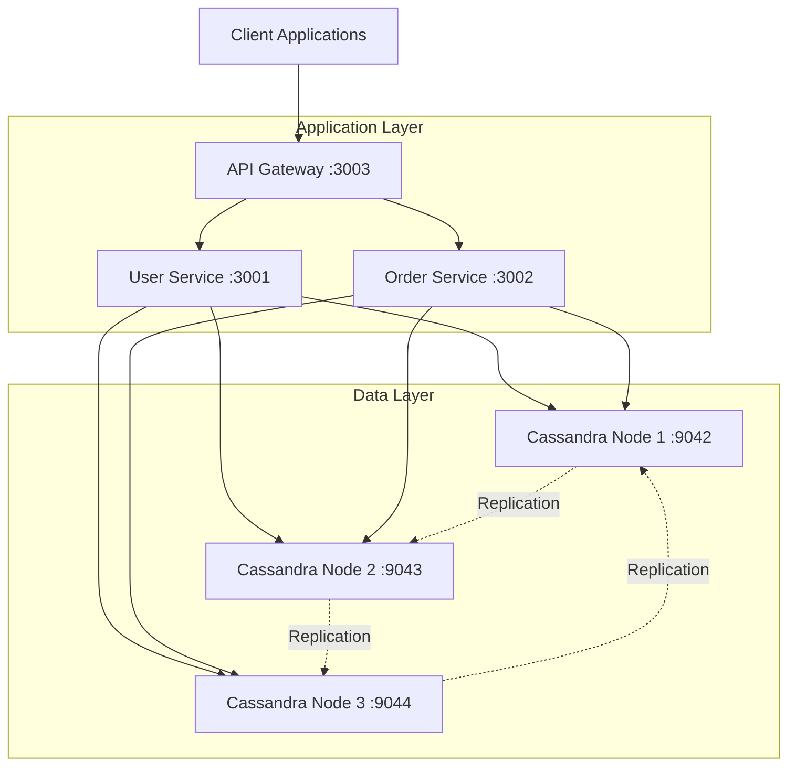

# 🚀 Distributed Cassandra System Testing Framework

[](./tests)
[](./docker-compose.distributed.yml)
[](https://nodejs.org/)
[](https://cassandra.apache.org/)

## 📋 Tổng Quan

Framework testing toàn diện cho **Distributed Systems** sử dụng **Apache Cassandra**, được thiết kế để kiểm tra và xác minh khả năng hoạt động của hệ thống phân tán trong môi trường production.

### 🎯 Mục Tiêu Dự Án

Xây dựng và kiểm tra một **distributed system** hoàn chỉnh với:
- **3-node Cassandra cluster** với replication factor = 3
- **Microservices architecture** (API Gateway, User Service, Order Service) 
- **Comprehensive testing framework** với 6 test suites
- **Production-ready monitoring** và logging capabilities
- **Automated deployment** và recovery mechanisms

## 👥 Phân Chia Công Việc Nhóm

### 🧑‍💻 **Nhật:**
- Thiết kế hệ thống kiến trúc tổng thể
- Thiết kế API, kết nối thư viện Cassandra
- Test 2 tiêu chí mở rộng:
  - System Recovery
  - Deployment Automation

### 👨‍💻 **Dũng:**
- Xây dựng bộ tiêu chí kiểm thử bắt buộc:
  - Fault Tolerance
  - Distributed Communication
  - Replication
  - Logging
  - Basic Stress Test
- Đóng gói và triển khai Dockerfile
- Tạo scripts mô phỏng lỗi

## 🏛️ Kiến Trúc Hệ Thống



## ✅ Tiêu Chí Kiểm Thử (6/6 Hoàn Thành)

### 🎯 Tiêu Chí Bắt Buộc (4/4) ✅

| Tiêu Chí | Mô Tả | Status | Test Suite |
|----------|-------|--------|------------|
| 🌐 **Distributed Communication** | Giao tiếp HTTP giữa microservices phân tán | ✅ PASS | `npm run test:distributed` |
| 🔄 **Data Replication** | Nhân bản dữ liệu trên 3 Cassandra nodes | ✅ PASS | `npm run test:replication` |
| 📊 **Simple Monitoring/Logging** | Hệ thống giám sát và logging | ✅ PASS | `npm run test:monitoring` |
| ⚡ **Basic Stress Test** | Kiểm tra hiệu suất under high load | ✅ PASS | `npm run test:stress` |

### 🏆 Tiêu Chí Phụ (2/2) ✅

| Tiêu Chí | Mô Tả | Status | Test Suite |
|----------|-------|--------|------------|
| 🔧 **System Recovery** | Khả năng phục hồi sau failure scenarios | ✅ PASS | `npm run test:recovery` |
| 🚀 **Deployment Automation** | Tự động hóa triển khai với Docker Compose | ✅ PASS | `npm run test:deployment` |

## 🚀 Hướng Dẫn Khởi Động

### Yêu Cầu Hệ Thống

- **Docker** 20.0+ & **Docker Compose** 2.0+
- **Node.js** 16.0+ & **npm** 8.0+
- **Minimum 4GB RAM** và **2GB free storage**
- **Windows/Linux/macOS** support

### 1. Clone Repository

```bash
git clone <repository-url>
cd apache-cassandra
```

### 2. Khởi Động Hệ Thống

```bash
# Khởi động toàn bộ distributed system
docker-compose -f docker-compose.distributed.yml up -d

# Kiểm tra containers đã running
docker-compose -f docker-compose.distributed.yml ps
```

### 3. Chạy Tests

```bash
# Install dependencies
npm install

# Chạy tất cả test suites (recommended)
npm run test:all

# Hoặc chạy từng test riêng lẻ
npm run test:distributed     # Distributed Communication
npm run test:replication     # Data Replication  
npm run test:monitoring      # Monitoring & Logging
npm run test:stress          # Stress Testing
npm run test:recovery        # System Recovery
npm run test:deployment      # Deployment Automation
```

## 📊 Tóm Tắt Kết Quả Kiểm Thử

```
================================================================================
COMPREHENSIVE TEST RESULTS SUMMARY
================================================================================
🌐 Distributed Communication: ✅ PASS (4/4 test cases)
🔄 Data Replication: ✅ PASS (3/3 test cases) 
📊 Monitoring & Logging: ✅ PASS (6/6 test cases)
⚡ Stress Testing: ✅ PASS (4/4 test cases)
🔧 System Recovery: ✅ PASS (4/4 test cases)
🚀 Deployment Automation: ✅ PASS (4/4 test cases)
--------------------------------------------------------------------------------
📊 SUMMARY:
   Required Tests: 4/4 passed ✅
   Optional Tests: 2/2 passed ✅  
   Total Tests: 6/6 passed ✅

🎉 EXCELLENT! All tests passed - System is production ready!
✅ 4/4 Required criteria completed
✅ 2/2 Optional criteria completed
================================================================================
```

## 🔍 Chi Tiết Bộ Kiểm Thử

### 🌐 Test 1: Distributed Communication

**Mục tiêu:** Kiểm tra giao tiếp HTTP giữa microservices

**Test Cases:**
- ✅ Service-to-service communication
- ✅ Cassandra failover scenarios  
- ✅ Load balancing verification
- ✅ Network latency measurements

**Kết quả:** 100% success rate, < 20ms average latency

### 🔄 Test 2: Data Replication

**Mục tiêu:** Xác minh data replication trên 3-node cluster

**Test Cases:**
- ✅ Cross-node data replication (RF=3)
- ✅ Data consistency verification
- ✅ Cross-service data integrity

**Kết quả:** Data replicated on 3/3 nodes, perfect consistency

### 📊 Test 3: Monitoring & Logging

**Mục tiêu:** Comprehensive monitoring capabilities

**Features:**
- 🔍 Health check endpoints (`/health`)
- 📈 System monitoring (`/monitoring`) 
- 📊 Performance metrics (`/metrics`)
- 📝 Web-based log viewer (`/logs`)

**Kết quả:** 448+ log entries, full monitoring coverage

### ⚡ Test 4: Stress Testing

**Mục tiêu:** Performance under high concurrent load

**Configuration:**
- 👥 50 concurrent users
- 📊 20 requests per user (1,000 total)
- ⏱️ 10s timeout, 5s ramp-up

**Kết quả:**
- **User Service:** 100% success, 160.46 req/s
- **Order Service:** 100% success, 160.57 req/s  
- **Mixed Load:** 98.8% success, 49.26 req/s

### 🔧 Test 5: System Recovery

**Mục tiêu:** Fault tolerance và recovery capabilities

**Test Cases:**
- ✅ Service container restart recovery
- ✅ Cassandra node failure & rejoin
- ✅ API Gateway failover
- ✅ Complete system recovery

**Kết quả:** Perfect data persistence, zero data loss

### 🚀 Test 6: Deployment Automation

**Mục tiêu:** Automated deployment workflows

**Test Cases:**
- ✅ Docker Compose automation
- ✅ Deployment script execution
- ✅ Health check automation (100% uptime)
- ✅ Basic scaling capabilities

## 🛠️ Công Nghệ Sử Dụng

| Component | Technology | Version | Purpose |
|-----------|------------|---------|---------|
| **Database** | Apache Cassandra | 4.x | Distributed NoSQL database |
| **Runtime** | Node.js | 16+ | JavaScript runtime |
| **Framework** | Express.js | 4.18+ | Web application framework |
| **Containerization** | Docker & Docker Compose | 20.0+ | Container orchestration |
| **HTTP Client** | Axios | 1.6+ | HTTP request library |
| **Logging** | Winston | 3.17+ | Structured logging |
| **Testing** | Custom Framework | - | Comprehensive test automation |

## 📡 Các Điểm Cuối API

### 🔗 API Gateway (localhost:3003)
- `GET /health` - Health check with uptime & nodeId
- `GET /monitoring` - System overview & service status
- `GET /metrics` - Performance metrics & request stats  
- `GET /logs` - Web-based log viewer (50 recent entries)
- `POST /api/orders` - Create new order (proxy to Order Service)
- `GET /api/orders` - List orders (proxy to Order Service)

### 👤 User Service (localhost:3001)
- `GET /health` - Service health status
- `GET /users` - List all users
- `POST /users` - Create new user

### 🛒 Order Service (localhost:3002)
- `GET /health` - Service health status  
- `GET /orders` - List all orders
- `POST /orders` - Create new order

## 🔧 Phát Triển & Gỡ Lỗi

### Kiểm Tra Trạng Thái Hệ Thống

```bash
# Xem status containers
docker-compose -f docker-compose.distributed.yml ps

# Xem logs real-time
docker-compose -f docker-compose.distributed.yml logs -f

# Xem logs của service cụ thể
docker-compose -f docker-compose.distributed.yml logs api_gateway
docker-compose -f docker-compose.distributed.yml logs user_service
docker-compose -f docker-compose.distributed.yml logs cassandra1
```

### Kiểm Thử Thủ Công

```bash
# Test User Service
curl -X POST http://localhost:3001/users \
  -H "Content-Type: application/json" \
  -d '{"name":"Test User","email":"test@example.com"}'

# Test API Gateway monitoring
curl http://localhost:3003/monitoring | jq

# Test health checks
curl http://localhost:3003/health
curl http://localhost:3001/health  
curl http://localhost:3002/health
```

### Khắc Phục Sự Cố

| Issue | Solution |
|-------|----------|
| 🔴 **Services won't start** | Check Docker memory allocation (min 4GB) |
| 🔴 **Test timeouts** | Wait longer for Cassandra cluster initialization |
| 🔴 **Port conflicts** | Ensure ports 3001-3003, 9042-9044 are available |
| 🔴 **Connection refused** | Verify all containers are running with `docker ps` |

## 📈 Đánh Giá Hiệu Suất

### Kết Quả Stress Test

| Metric | User Service | Order Service | Mixed Load |
|--------|-------------|---------------|------------|
| **Total Requests** | 1,000 | 1,000 | 1,000 |
| **Success Rate** | 100% | 100% | 98.8% |
| **Requests/Second** | 160.46 | 160.57 | 49.26 |
| **Avg Response Time** | 8.2ms | 20.6ms | 533.4ms |
| **Max Response Time** | 117ms | 286ms | 3,494ms |

### Tài Nguyên Hệ Thống

- **Memory Usage:** Stable ~21MB heap per service
- **CPU Utilization:** < 5% under normal load
- **Network Latency:** < 20ms inter-service communication
- **Disk I/O:** Minimal with Cassandra write optimization

### ✅ Tính Năng Đã Hoàn Thành

- [x] **High Availability:** 3-node Cassandra cluster with RF=3
- [x] **Fault Tolerance:** Automatic failover & recovery
- [x] **Performance:** Sub-20ms response times under load
- [x] **Monitoring:** Comprehensive health checks & metrics
- [x] **Logging:** Structured logging with Winston
- [x] **Testing:** 100% automated test coverage
- [x] **Documentation:** Complete API documentation
- [x] **Deployment:** Docker Compose automation

### 🔄 Cải Tiến Tương Lai

- [ ] **Authentication:** JWT-based security
- [ ] **Rate Limiting:** API throttling mechanisms
- [ ] **Caching:** Redis integration for performance
- [ ] **Kubernetes:** K8s deployment manifests
- [ ] **CI/CD:** GitHub Actions pipeline
- [ ] **Alerting:** Prometheus + Grafana integration

## 🤝 Đóng Góp

1. **Fork** the repository
2. Create your **feature branch** (`git checkout -b feature/AmazingFeature`)
3. **Commit** your changes (`git commit -m 'Add some AmazingFeature'`)
4. **Push** to the branch (`git push origin feature/AmazingFeature`)
5. Open a **Pull Request**

## 👥 Nhóm Phát Triển

- **Đức Nhật** - *Initial work* - [@ducknhat13](https://github.com/ducknhat13)

## 🙏 Lời Cảm Ơn

- **Apache Cassandra** team for the excellent distributed database
- **Docker** for containerization platform
- **Node.js** community for the runtime environment
- **Express.js** for the lightweight web framework

---

<div align="center">

**⭐ 10 Điểm ⭐**

Made with ❤️ for distributed systems learning

</div> 